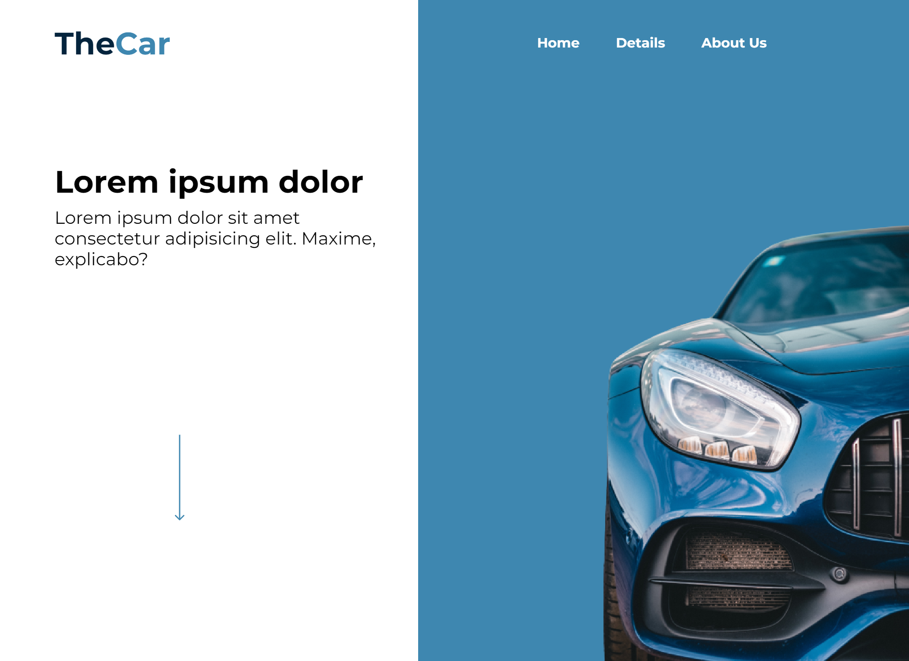

# TheCar

TheCar is a responsive landing page about cars, created with vanilla HTML, CSS and JavaScript. It features beautiful transitions and animations to bring life to the page. The application can be tested [here](https://imklesley.github.io/TheCar_responsive_landing_page/).

Other project images can be found [here](./github/assets/).

## Features

- Responsive design for mobile and desktop
- Animations and transitions for a bettr user experience

## Installation

1. Clone the repository.
2. Open index.html in your favorite browser.

##

Developed by Klesley Gonçalves

